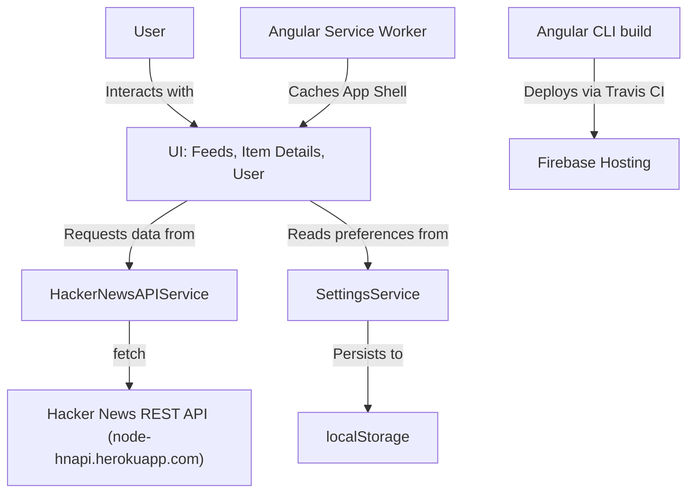

<p align="center">
  <a href="https://angular2-hn.firebaseapp.com">
    
  </a>
</p>

<p align="center">
  A progressive Hacker News client built with Angular
</p>

<p align="center">
  <a href="https://angular2-hn.firebaseapp.com">View App</a>
</p>

<p align="center">
  <a href="/CONTRIBUTING.md"></a>
  <a href="https://travis-ci.org/housseindjirdeh/angular2-hn"></a>
</p>

---

Angular 2 HN is a Progressive Web Application (PWA) that provides a fast, responsive and offline-capable client for [Hacker News](https://news.ycombinator.com). It follows a Service Worker App Shell + Dynamic Content model: the application shell is precached by a service worker so it loads instantly with or without a network, while story, comment and user data are fetched from a Hacker News REST API at runtime.

- **Fast:** App Shell model with service worker caching for quick loads on slow networks or offline.
- **Responsive:** Fully responsive UI that can be installed to a mobile home screen for a native feel.
- **Progressive:** Web App Manifest, Angular service worker and a [Lighthouse](https://github.com/GoogleChrome/lighthouse) score of 87/100.

<p align="center">
  
</p>

## Table of Contents

- [Previews](#previews)
- [Key Technologies](#key-technologies)
- [Architecture](#architecture)
- [Project Structure](#project-structure)
- [Data Layer](#data-layer)
- [Settings and Theming](#settings-and-theming)
- [PWA and Service Worker](#pwa-and-service-worker)
- [Getting Started](#getting-started)
- [Testing](#testing)
- [Deployment and CI/CD](#deployment-and-cicd)
- [Glossary](#glossary)
- [Areas of improvement](#areas-of-improvement)
- [Contributors](#contributors)

## Previews

### Mobile

<p align="center">
  
</p>

### Laptop

<p align="center">
  
</p>

### Manifest

With Chromium based browsers for Android (Chrome, Opera, etc.), Angular 2 HN includes a Web App Manifest that allows you to install it to your home screen.

<p align="center">
  
</p>

## Key Technologies

| Technology | Role |
| :--- | :--- |
| [Angular](https://angular.io) 9 | Application framework (`@angular/core`, `@angular/router`, `@angular/forms`, ...) |
| [Angular CLI](https://cli.angular.io) | Build, serve, lint and test tooling (`angular.json`) |
| [@angular/service-worker](https://angular.io/guide/service-worker-intro) | Service worker generation and App Shell caching (`ngsw-config.json`) |
| [RxJS](https://rxjs.dev) 6 | Observable-based data access |
| [unfetch](https://github.com/developit/unfetch) | Minimal `fetch` polyfill wrapped in Observables for API calls |
| TypeScript 3.7, SCSS | Language and styling |
| [Karma](https://karma-runner.github.io) + [Jasmine](https://jasmine.github.io) | Unit tests |
| [Protractor](https://www.protractortest.org) | End-to-end tests |
| [TSLint](https://palantir.github.io/tslint/) + [Codelyzer](http://codelyzer.com) | Linting |
| [Firebase Hosting](https://firebase.google.com/docs/hosting) | Production hosting (`firebase.json`, `.firebaserc`) |
| [Travis CI](https://travis-ci.org) | Continuous integration and deployment (`.travis.yml`) |

## Architecture

The application is a standard Angular CLI project organised around a root module, a core module, lazy-loaded feature modules and a shared layer.



### Root module and bootstrapping

`src/main.ts` bootstraps `AppModule` (`src/app/app.module.ts`), which:

- declares `AppComponent`, `FeedComponent` and `ItemComponent`;
- imports `BrowserModule`, the `routing` configuration, `CoreModule`, `SharedComponentsModule` and `PipesModule`;
- registers the Angular service worker with `ServiceWorkerModule.register('ngsw-worker.js', { enabled: environment.production })`, so the service worker is only active in production builds;
- provides `HackerNewsAPIService` and `SettingsService` as application-wide singletons.

`AppComponent` is the root shell. It subscribes to router `NavigationEnd` events to send Google Analytics page views and applies the active theme class from `SettingsService`.

### Routing and navigation

Routes are defined in `src/app/app.routes.ts`:

| Path | Target | Notes |
| :--- | :--- | :--- |
| `''` | redirect to `news/1` | Default landing page |
| `news/:page`, `newest/:page`, `show/:page`, `ask/:page`, `jobs/:page` | `FeedComponent` | Each parent route carries `data: { feedType }` which the component uses to decide which feed to fetch |
| `item/...` | `ItemDetailsModule` | Lazy loaded via `loadChildren` |
| `user/...` | `UserModule` | Lazy loaded via `loadChildren` |

Lazy loading the item and user modules keeps the initial bundle small; the feed list is part of the main bundle since it is the landing page.

### Core module

`CoreModule` (`src/app/core/`) contains the persistent chrome of the app:

- `HeaderComponent` - navigation between feed types and a settings toggle.
- `FooterComponent` - footer links.
- `SettingsComponent` - the settings panel (theme, title font size, list spacing, open links in new tab) backed by `SettingsService`.

### Feature modules

- **Feeds** (`src/app/feeds/`): `FeedComponent` renders a paginated list of stories for the current `feedType` and page. It computes `listStart = (pageNum - 1) * 30 + 1` so rank numbers stay correct across pages (1-30, 31-60, ...). `ItemComponent` renders a single story row and honours the "open links in new tab" setting.
- **Item Details** (`src/app/item-details/`): `ItemDetailsModule` is lazy loaded and shows a story with its recursive comment tree (`CommentComponent`) and poll results where applicable. `goBack()` uses Angular's `Location` service to return to the previous page.
- **User Profile** (`src/app/user/`): `UserModule` is lazy loaded and shows a Hacker News user's karma, creation date and about text.

### Shared layer

`src/app/shared/` holds code reused across features:

- `components/`: `SharedComponentsModule` with `LoaderComponent` and `ErrorMessageComponent`.
- `pipes/`: `PipesModule` with `CommentPipe`, which formats a comment count as `"discuss"`, `"1 comment"` or `"N comments"`.
- `models/`: TypeScript interfaces (`Story`, `Comment`, `User`, `PollResult`, `Settings`, `FeedType`).
- `services/`: `HackerNewsAPIService` and `SettingsService`.
- `scss/`: `_media.scss` (breakpoints), `_theme_variables.scss` and `_themes.scss` (theme engine).

## Project Structure

```
angular2-hn/
├── angular.json            # Angular CLI workspace config (build, serve, test, lint, e2e)
├── package.json            # Dependencies and npm scripts
├── ngsw-config.json        # Angular service worker asset groups
├── firebase.json           # Firebase Hosting rules (SPA rewrite to /index.html) and database rules
├── .firebaserc             # Firebase project aliases: default, experiment
├── database.rules.json     # Firebase Realtime Database security rules
├── .travis.yml             # CI: build on master and deploy to Firebase
├── karma.conf.js           # Unit test runner config
├── tslint.json             # Lint rules
├── browserslist            # Target browsers
├── tsconfig*.json          # Base, app and spec TypeScript configs
├── e2e/                    # Protractor end-to-end tests
│   ├── protractor.conf.js
│   └── src/
└── src/
    ├── index.html          # App Shell entry point, manifest and theme-color metadata
    ├── main.ts             # Bootstraps AppModule
    ├── polyfills.ts        # Browser polyfills (evergreen browsers)
    ├── styles.scss         # Global styles
    ├── manifest.json       # Web App Manifest
    ├── assets/             # Icons and static assets
    ├── environments/       # environment.ts / environment.prod.ts
    └── app/
        ├── app.module.ts   # Root module
        ├── app.routes.ts   # Route definitions
        ├── app.component.* # Root shell component
        ├── core/           # Header, footer, settings panel
        ├── feeds/          # FeedComponent, ItemComponent
        ├── item-details/   # Lazy-loaded story + comments module
        ├── user/           # Lazy-loaded user profile module
        └── shared/         # Components, pipes, models, services, SCSS
```

Production builds are written to `dist/angular-hnpwa` (the `outputPath` in `angular.json`).

## Data Layer

`HackerNewsAPIService` (`src/app/shared/services/hackernews-api.service.ts`) is the single point of contact with the backend. It targets the unofficial Hacker News REST API at `https://node-hnapi.herokuapp.com` and exposes:

| Method | Endpoint | Returns |
| :--- | :--- | :--- |
| `fetchFeed(feedType, page)` | `GET /{feedType}?page={page}` | `Observable<Story[]>` |
| `fetchItemContent(id)` | `GET /item/{id}` | `Observable<Story>` (also loads poll options for `poll` items) |
| `fetchPollContent(id)` | `GET /item/{id}` | `Observable<PollResult>` |
| `fetchUser(id)` | `GET /user/{id}` | `Observable<User>` |

Requests go through a small `lazyFetch` helper that wraps `unfetch` in an RxJS `Observable`, so components can subscribe and unsubscribe like any other Angular data source.

Data models live in `src/app/shared/models/`: `Story` (id, title, url, points, user, time, comments_count, type, comments, ...), `Comment` (recursive nested comments), `User`, `PollResult`, `Settings` and the `FeedType` alias.

## Settings and Theming

`SettingsService` (`src/app/shared/services/settings.service.ts`) holds a `Settings` object with:

- `theme` - `default`, `night` or `amoledblack`
- `titleFontSize` and `listSpacing` - typography and density of the feed list
- `openLinkInNewTab` - whether story links open in a new tab
- `showSettings` - visibility of the settings panel

All preferences are persisted to `localStorage`. If no theme has been saved, the service listens to the `prefers-color-scheme` media query and automatically picks `night` or `default` to follow the operating system, and switches when the system preference changes.

Themes are implemented in SCSS. `_themes.scss` defines a `theme()` mixin that takes a theme name and a set of colour variables and emits a `.<name>` class; `default`, `night` and `amoledblack` are generated from it, and `AppComponent` applies the active class to the page. Adding a theme is a matter of adding another `@include theme(...)` with new variables.

Current themes:

- Default
- Night
- Black (AMOLED)

## PWA and Service Worker

Offline support is provided by the Angular service worker (`@angular/service-worker`):

- `angular.json` enables `serviceWorker: true` with `ngswConfigPath: ngsw-config.json` for the `production` configuration, so `ng build --prod` emits `ngsw-worker.js` and `ngsw.json` into `dist/angular-hnpwa`.
- `ngsw-config.json` defines two asset groups: `app` (prefetched: `index.html`, CSS, JS, favicon and manifest - the App Shell) and `assets` (lazily cached images and fonts under `/assets/**`).
- `AppModule` registers `ngsw-worker.js` only when `environment.production` is true, so the service worker is never active during `ng serve`.

`src/index.html` links the Web App Manifest and sets `theme-color`, and `src/manifest.json` supplies the name, icons, start URL and display mode used for home screen installation.

## Getting Started

### Prerequisites

- Node.js and npm
- Angular CLI (optional globally; `npx ng` also works): `npm install -g @angular/cli`

### Install

```bash
git clone https://github.com/COG-GTM/angular2-hn.git
cd angular2-hn
npm install
```

### Run in development

```bash
npm start
```

Runs `ng serve` with live reload at `http://localhost:4200`. Service worker changes are not reflected in development mode because the worker is only registered in production builds.

### Build for production

```bash
npm run build -- --prod
```

Runs `ng build` with the `production` configuration (AOT, optimisation, output hashing, service worker). Output goes to `dist/angular-hnpwa`.

### Validate PWA behaviour locally

The service worker must be tested from a static server over the production build. Any static file server works, for example:

```bash
npm run build -- --prod
npx http-server dist/angular-hnpwa -p 8080
```

Then open `http://localhost:8080`, and in the browser DevTools Application tab confirm the service worker is registered and the manifest is detected. Enable "Offline" in the Network tab and reload to confirm the App Shell still loads.

### Lint

```bash
npm run lint
```

## Testing

- **Unit tests** (Karma + Jasmine): `npm test` runs `ng test`. Spec files live next to their sources as `*.spec.ts`; the entry point is `src/test.ts` and the runner is configured in `karma.conf.js`. Use `npm test -- --watch=false` for a single headless run.
- **End-to-end tests** (Protractor): `npm run e2e` runs `ng e2e` using `e2e/protractor.conf.js` and the specs in `e2e/src/`.

## Deployment and CI/CD

- **Firebase Hosting**: `firebase.json` serves the built app with a catch-all rewrite to `/index.html` so Angular's client-side router handles deep links, and points at `database.rules.json` for Realtime Database rules. `.firebaserc` defines two project aliases: `default` (`angular2-hn`) and `experiment` (`angular2-hn-experiment`) for sandbox deployments.
- **Travis CI**: `.travis.yml` builds only the `master` branch. It installs `firebase-tools` and `@angular/cli`, runs `npm run build`, and on success runs `firebase use default` followed by `firebase deploy --token $FIREBASE_TOKEN`. `FIREBASE_TOKEN` is provided as an encrypted Travis environment variable.

## Glossary

| Term | Definition |
| :--- | :--- |
| App Shell | The minimal HTML, CSS and JS needed to render the UI, precached by the service worker for instant loads (`src/index.html`, `ngsw-config.json`). |
| `app-root` | The custom element in `src/index.html` where Angular bootstraps `AppComponent`. |
| `feedType` | Route `data` string (`news`, `newest`, `show`, `ask`, `jobs`) that tells `FeedComponent` which feed to fetch (`src/app/app.routes.ts`). |
| `FeedType` | TypeScript alias (`'poll' | 'story' | 'job'`) for the type of an individual item (`src/app/shared/models/feed-type.type.ts`). |
| `HackerNewsAPIService` | Singleton service that wraps all calls to the Hacker News REST API. |
| `lazyFetch` | Helper in the API service that wraps `unfetch` in an RxJS `Observable`. |
| `SettingsService` | Singleton that stores user preferences (theme, font size, spacing, link behaviour) in `localStorage`. |
| `darkColorSchemeMedia` | `MediaQueryList` in `SettingsService` used to follow the system `prefers-color-scheme`. |
| `FeedComponent` | Route component that renders a paginated feed based on `feedType`. |
| `listStart` | Rank of the first item on the current page, `(page - 1) * 30 + 1`. |
| `ItemComponent` | Renders a single story row within a feed. |
| `ItemDetailsModule` | Lazy-loaded module for a story and its nested comment tree. |
| `UserModule` | Lazy-loaded module for user profiles. |
| `CommentPipe` | Pipe that formats a comment count (`discuss`, `1 comment`, `N comments`). |
| `ngsw-worker.js` | The Angular service worker file, registered only in production. |
| `ngsw-config.json` | Angular service worker configuration describing which assets to cache and how. |
| AMOLED theme | The `amoledblack` pure black theme intended for OLED screens. |
| `experiment` | Firebase project alias for sandbox deployments (`.firebaserc`). |
| `FIREBASE_TOKEN` | Environment variable Travis CI uses to authenticate `firebase deploy`. |
| SPA rewrites | `firebase.json` rule routing every path to `/index.html` for client-side routing. |
| AOT | Ahead-of-Time compilation of Angular templates at build time (enabled in `angular.json`). |

## Areas of improvement

- Realtime updating using the Firebase SDK (may need to add an option to settings so the service worker can still rely on REST endpoints)
- Server side rendering

Feel free to send feedback on [twitter](https://twitter.com/hdjirdeh) or [file an issue](https://github.com/hdjirdeh/angular2-hn/issues/new). Feature requests are always welcome.

## Contributors

A million thanks to some awesome people :)

* [Ashwin Sureshkumar](https://github.com/ashwin-sureshkumar)
* [Mateusz](https://github.com/mateuszwitkowski)
* [Jordi Collell](https://github.com/jordic)
* [Ben Brooks](https://github.com/bbrks)
* [Zach Berger](https://github.com/zachberger)
* [blAck PR](https://github.com/blackpr)
* [Bram Borggreve](https://github.com/beeman)
* [Antonio Indrianjafy](https://github.com/Antogin)
* [Addy Osmani](https://github.com/addyosmani)
* [Majid Hajian](https://github.com/mhadaily)
* [Jeff Cross](https://github.com/jeffbcross)
* [Minko Gechev](https://github.com/mgechev)
